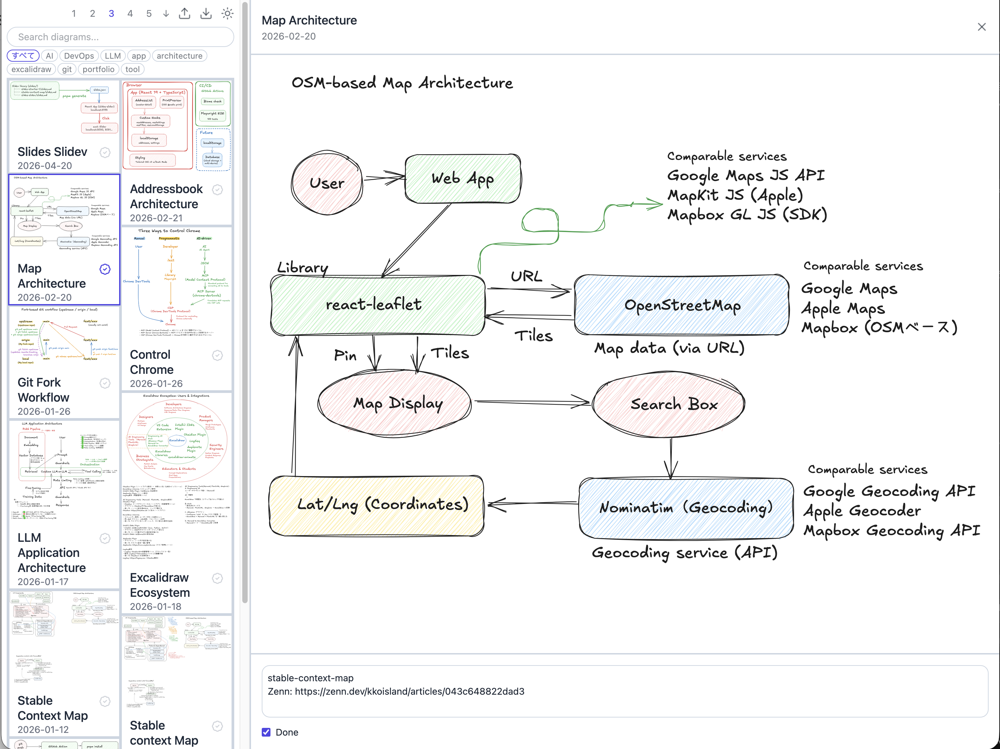

# image-notes

A web app to browse images in a Masonry grid, view them full-size, and manage notes.

Built for personal use to organize my own image collection — generalized as a reusable template.

## Resources

🚀 **Live**: https://kkoisland.github.io/image-notes/c5b84e1f034aca86/
📝 **Slides**: https://www.kkoisland.com/slides-slidev/slides/image-notes/

## Features

- Browse images (.svg, .png, .jpg, .jpeg, .gif, .webp) in a responsive Masonry grid
- Click to expand: split view with full-size image on the right and scrollable list on the left
- Add memo and done flag per image — auto-saved to localStorage
- Done indicator (badge) on cards — toggle directly from the list or in the detail view
- Export / Import notes as `notes.json`
- Search by title and filter by category
- Sort by newest or oldest (toggle button in toolbar)
- 1–5 column layout toggle
- Dark mode with system preference detection and localStorage persistence



## Project Structure

```
image-notes/
├── public/
│   ├── images/            # place your image files here (.svg, .png, .jpg, .jpeg, .gif, .webp)
│   └── images.json        # image list — run `pnpm generate` to update
├── src/
│   ├── App.tsx
│   ├── ImageCard.tsx
│   ├── DetailView.tsx
│   ├── types.ts
│   └── main.tsx
├── generate-images.ts     # reads public/images/, writes public/images.json
└── vite.config.ts
```

## Usage

### Adding images

Place image files in `public/images/`, then run `pnpm generate` to update `images.json`. The script scans the directory and auto-generates a UUID and title from each filename. You can manually edit `images.json` to update titles, add categories, or adjust dates.

### Notes

Memos and done flags are stored in localStorage and are local to your browser. Use the **Export** button in the toolbar to download `notes.json` as a backup, and the **Import** button to restore it.

### URL token (semi-private)

The live URL includes a random token (e.g., `kkoisland.github.io/image-notes/c5b84e1f034aca86/`) to make it non-discoverable without the exact URL. To set your own token, generate one and replace `c5b84e1f034aca86` in `vite.config.ts`, `.github/workflows/deploy.yml`, and your Live URL:

```bash
openssl rand -hex 8
```

### Managing image files with git

By default, image files are gitignored and not committed. If you prefer to manage them via git (e.g., sync across machines with `git pull`), remove the `public/images/*` line from `.gitignore` and commit your images.

### Using on another machine

Image files are gitignored, so they are not synced via git — you need to copy them manually.

1. On the current machine, export `notes.json` from the toolbar
2. On the new machine, clone the repo and copy your image files to `public/images/`
3. `nvm use && pnpm i && pnpm dev`
4. Import `notes.json` from the toolbar to restore your memos and done flags

## Local Development

1. Add your image files to `public/images/`
2. Run:

```bash
nvm use
pnpm i
pnpm dev        # generates images.json and starts the dev server
```

http://localhost:5173/

## Tech Stack

- React + TypeScript
- Vite
- Tailwind CSS v4
- react-masonry-css
- lucide-react
- Biome (Formatter + Linter)
- GitHub Actions + GitHub Pages

## Data Structure

`images.json` is the manifest file for your image collection, generated by `pnpm generate`. Edit it manually to set titles, categories, or dates.

```json
[
  {
    "id": "uuid",
    "title": "My Image",
    "filename": "my-image.png",
    "path": "images/my-image.png",
    "createdAt": "2026-01-01",
    "categories": ["category-name"],
    "hidden": false
  }
]
```

## Deploy

Automatically deployed to GitHub Pages via GitHub Actions on every push to `main`.
